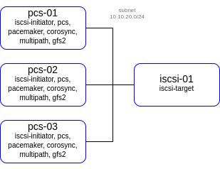

# lab-04
keepalived
otus | Load balancing based on HAProxy and VRRP (keepalived)

### Домашнее задание
настройка конфигурации веб приложения под высокую нагрузку

#### Цель:
terraform и ansible роль для развертывания серверов веб приложения под высокую нагрузку и отказоустойчивость
в работе должны применяться:

- keepalived,
- nginx,
- uwsgi/unicorn/php-fpm
- некластеризованная бд mysql/mongodb/postgres/redis
- gfs2
- должна быть реализована
- отказоустойчивость бэкенд и nginx серверов
- отказоустойчивость сессий
- фэйловер без потери статического контента
- должны быть реализованы ansible скрипты с тюнингом
- параметров sysctl
- лимитов
- настроек nginx
- включением пулов соединений

#### Описание/Пошаговая инструкция выполнения домашнего задания:
1. Создать несколько инстансов с помощью терраформ (2 nginx, 2 backend, 1 db);
2. Развернуть nginx и keepalived на серверах nginx при помощи ansible
3. Развернуть бэкенд способный работать по uwsgi/unicorn/php-fpm и базой. (Можно взять что нибудь из Django) при помощи ansible.
4. Развернуть gfs2 для бэкенд серверах, для хранения статики
5. Развернуть бд для работы бэкенда при помощи ansbile
6. Проверить отказоустойчивость системы при выходе из строя серверов backend/nginx

#### Критерии оценки:
Статус "Принято" ставится при выполнении перечисленных требований.


### Выполнение домашнего задания

#### Создание стенда

Стенд будем разворачивать с помощью Terraform на YandexCloud, настройку серверов будем выполнять с помощью Ansible.

Необходимые файлы размещены в репозитории GitHub по ссылке:
```
https://github.com/SergSha/lab-04.git
```

Схема:



Для начала получаем OAUTH токен:
```
https://cloud.yandex.ru/docs/iam/concepts/authorization/oauth-token
```

Настраиваем аутентификации в консоли:
```
export YC_TOKEN=$(yc iam create-token)
export TF_VAR_yc_token=$YC_TOKEN
```

Для того чтобы развернуть стенд, нужно выполнить следующую команду:
```
git clone https://github.com/SergSha/lab-04.git && cd ./lab-04 && \
terraform init && terraform apply -auto-approve && \
sleep 30 && ansible-playbook ./provision.yml
```

На всех серверах будут установлены ОС Almalinux 8, настроены смнхронизация времени Chrony, в качестве firewall будет использоваться NFTables.

#### iSCSI-target

Сервер iscsi-01 будет служить iSCSI таргетом. В нём будут настроены три типа таргета:
  - fileio,
  - block,
  - ramdisk.

