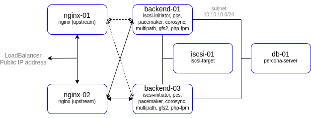

# lab-04
keepalived
otus | Load balancing based on HAProxy and VRRP (keepalived)

### Домашнее задание
настройка конфигурации веб приложения под высокую нагрузку

#### Цель:
terraform и ansible роль для развертывания серверов веб приложения под высокую нагрузку и отказоустойчивость
в работе должны применяться:

- keepalived,
- nginx,
- uwsgi/unicorn/php-fpm
- некластеризованная бд mysql/mongodb/postgres/redis
- gfs2
- должна быть реализована
- отказоустойчивость бэкенд и nginx серверов
- отказоустойчивость сессий
- фэйловер без потери статического контента
- должны быть реализованы ansible скрипты с тюнингом
- параметров sysctl
- лимитов
- настроек nginx
- включением пулов соединений

#### Описание/Пошаговая инструкция выполнения домашнего задания:
1. Создать несколько инстансов с помощью терраформ (2 nginx, 2 backend, 1 db);
2. Развернуть nginx и keepalived на серверах nginx при помощи ansible
3. Развернуть бэкенд способный работать по uwsgi/unicorn/php-fpm и базой. (Можно взять что нибудь из Django) при помощи ansible.
4. Развернуть gfs2 для бэкенд серверах, для хранения статики
5. Развернуть бд для работы бэкенда при помощи ansbile
6. Проверить отказоустойчивость системы при выходе из строя серверов backend/nginx

#### Критерии оценки:
Статус "Принято" ставится при выполнении перечисленных требований.


### Выполнение домашнего задания

#### Создание стенда

Стенд будем разворачивать с помощью Terraform на YandexCloud, настройку серверов будем выполнять с помощью Ansible.

Необходимые файлы размещены в репозитории GitHub по ссылке:
```
https://github.com/SergSha/lab-04.git
```

Схема:



Для начала получаем OAUTH токен:
```
https://cloud.yandex.ru/docs/iam/concepts/authorization/oauth-token
```

Настраиваем аутентификации в консоли:
```
export YC_TOKEN=$(yc iam create-token)
export TF_VAR_yc_token=$YC_TOKEN
```

Для того чтобы развернуть стенд, нужно выполнить следующую команду:
```
git clone https://github.com/SergSha/lab-04.git && cd ./lab-04 && \
terraform init && terraform apply -auto-approve && \
sleep 30 && ansible-playbook ./provision.yml
```

На всех серверах будут установлены ОС Almalinux 8, настроены смнхронизация времени Chrony, система принудительного контроля доступа SELinux, в качестве firewall будет использоваться NFTables.

Сервера nginx-01 и nginx-02 будут служить балансировщиками нагрузки для распределения пакетов между серверами backend-01 и backend-02. Для балансировки на серверах nginx-01 и nginx-02 будет использоватья приложение Nginx. 
Балансировку настроим в режиме Round Robin, с максимальном количеством ошибок - 2, и timeout - 90 секунд:
```
upstream backend {
        server {{ ip_address['backend-01'] }}:80 max_fails=2 fail_timeout=90s;
        server {{ ip_address['backend-02'] }}:80 max_fails=2 fail_timeout=90s;
}
```

Для создания общего виртуального IP адреса для балансирощиков нагрузки обычно используется keepalived. Так как на YandexCloud keepalived реализовать невозможно, воспользуемся аналогичным ресурсом YandexCloud yandex_lb_network_load_balancer, что будет в свою очередь имитировать работу keepalived.

Сервера backend-01 и backend-02 входят в PCS кластер. На этих серверах установлены и настроены pcs, pacemaker, corosync, также веб-приложение nginx и php-fpm. Эти сервера имеют общее iSCSI хранилище, в которм размещены файлы сайта. iSCSI хранилище настроено с помощью LVM2 под файловую систему GFS2.

Для общего iSCSI хранилища был создан целевой iSCSI сервер iscsi-01, в котором имеется отдельно созданный диск, настроенный для расшаривания по iSCSI.

Для хранения баз данных будет использоваться сервер db-01, но котором установлено приложение Percona server для MySQL.

Для проверки работы развернутого стенда воспользуемся отображением в браузере веб-страниц, размещённых на серверах backend-01 и backend-02. 

Получим запущенные виртуальные машины:


Для проверки работы балансировщика воспользуемся отображением простой страницы собственноручно созданного сайта на PHP, 
имитирующий продажу новых и подержанных автомобилей:


При напонении сайта данные будут размещаться на сервере db-01. На данном сервере установлено приложение MySQL от Percona.
Заранее создана база данных 'cars', в котором созданы таблицы 'new' и 'used', имитирующие списки соответственно новых и подержанных автомобилей.

Начнём наполнять этот сайт:


Отключим одну виртуальную машину из балансировщиков, например, nginx-01:


Обновим страницу:


Продолжим наполнять сайт:


Как видим, сайт работает без балансировщика nginx-01.

Отключим одну виртуальную машину из бэкендов, например, backend-01:


Обновим страницу:


Добавим позицию:


Сайт работает без балансировщика nginx-01 и бэкенда backend-01.

Включим backend-01 и отключим backend-02:


Обновим страницу:


Добавим ещё позицию:


Сайт работает без балансировщика nginx-01 и бэкенда backend-02.

Теперь включим nginx-01 и отключим nginx-02:


Обновим страницу:


Добавим ещё позицию:


Сайт работает без балансировщика nginx-02 и бэкенда backend-02.

Этот результат ещё и показывает, что работает load balancer от YandexCloud с общим IP адресом для балансировщиков nginx-01 и nginx-02.

Теперь включим backend-02 и снова отключим backend-01:


Ещё раз обновим страницу:


И добавим ещё одну позицию:


Как мы наблюдаем, сайт работает при любых вариантах отключения балансировщика и бэкенда.

По ssh подключимся к серверу db-01:
```
ssh -i ~/.ssh/otus cloud-user@158.160.65.49
```
чтобы проверить наличие заполненных таблиц MySQL new и used в базе данных cars:
```
[root@db-01 ~]# mysql -e "SELECT * FROM cars.new"
+----+------+------+---------+
| id | name | year | price   |
+----+------+------+---------+
|  6 | Ford | 2023 | 2199000 |
|  7 | Opel | 2020 |  899000 |
|  8 | Lada | 2022 | 1099000 |
|  9 | Kia  | 2021 | 1799000 |
+----+------+------+---------+
[root@db-01 ~]# mysql -e "SELECT * FROM cars.used"
+----+---------+------+---------+
| id | name    | year | price   |
+----+---------+------+---------+
|  6 | Toyota  | 2015 | 1050000 |
|  7 | Renault | 2017 |  950000 |
|  8 | Nissan  | 2007 |  700000 |
|  9 | Hyundai | 2013 |  670000 |
+----+---------+------+---------+
[root@db-01 ~]#
```
Как видим, таблицы заполнены.

На этом убеждаемся, что развернутый нами стенд работает корректно.


#### Удаление стенда

Удалить развернутый стенд командой:
```
terraform destroy -auto-approve
```
